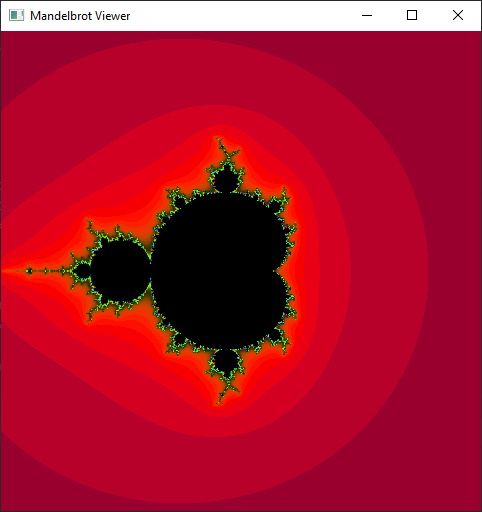
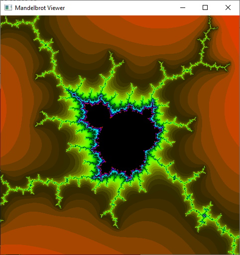

# Mandelbrot Viewer
Mandelbrot Viewer is a simple application which utilises the GPU via OpenGL to visualize the Mandelbrot Set in real time.  
It has up to a 32-bit zoom due to the limitations of OpenGL floats.

## Preview

## Building

  The application can be built with [Maven](https://maven.apache.org/):
    
    mvn clean package
    
  The jar file will be available in the `./target` directory.

## Controls

  <kbd>W</kbd>, <kbd>A</kbd>, <kbd>S</kbd>, <kbd>D</kbd> for panning.
  
  <kbd>Z</kbd>, <kbd>X</kbd> or scroll wheel for zooming in and out.
  
  <kbd>K</kbd> to take a screenshot. **(Currently Disabled)**
  
## Configuration

Some useful configuration variables:

  **src/Application.java**
  
    PIXEL_WIDTH & PIXEL_HEIGHT:
    - The window's resolution.
    WIDTH & HEIGHT:
    - The scale of the complex axis (4 would be [-2, 2]).
    TITLE:
    - The window's title.
    BACKGROUND_COLOUR:
    - The window's background colour.
    
  **res/shaders/frag.shader**
  
    This file contains the math for generating the Mandelbrot Set. 
    If you wish to change the colours of the set you should modify the colorFunc function.
    It takes in a parameter "iter" which is the number of iterations it took before the 
    modulus of a point on the set became >= 4.
    
## Libraries

* [LWJGL 3](https://www.lwjgl.org/) (minimal OpenGL configuration)
* [JOML](https://github.com/JOML-CI/JOML) (math library)
