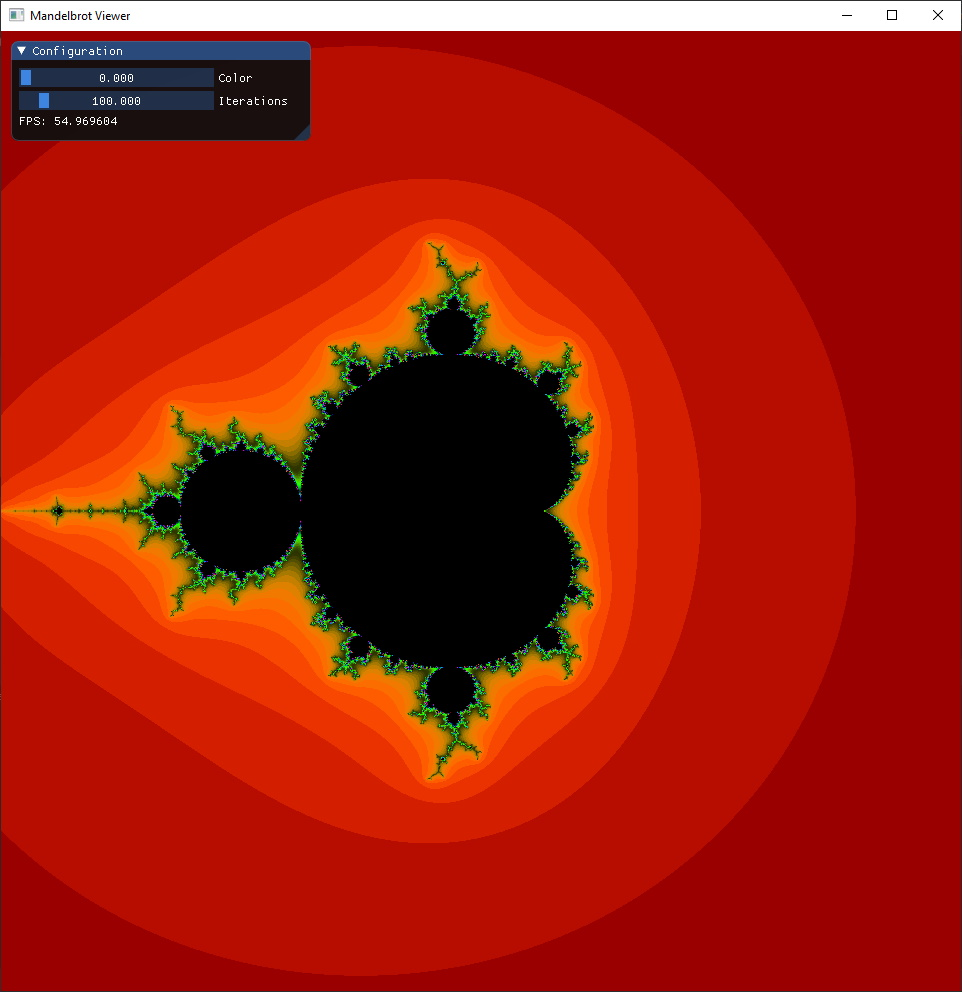
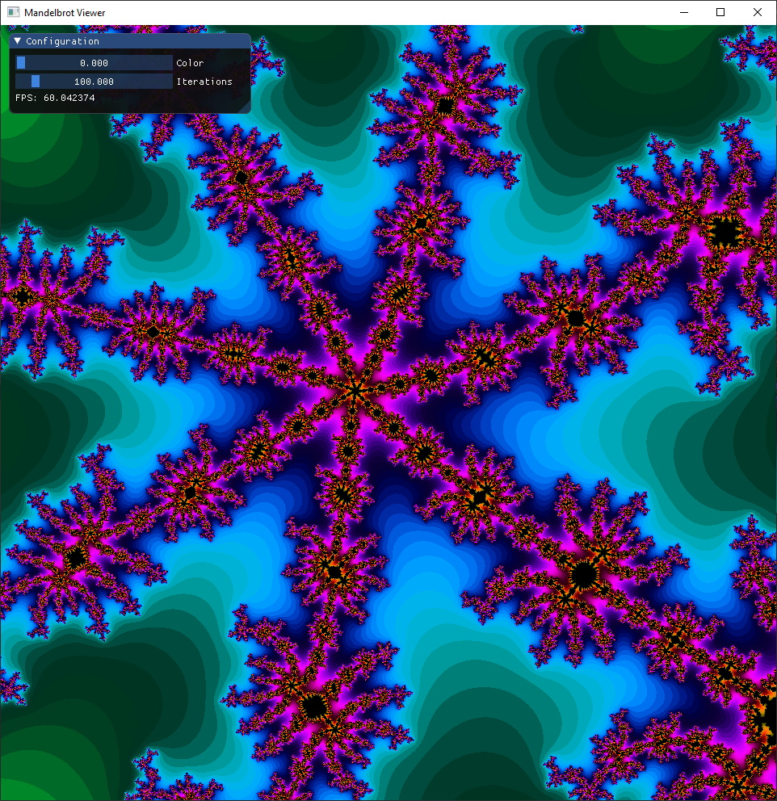
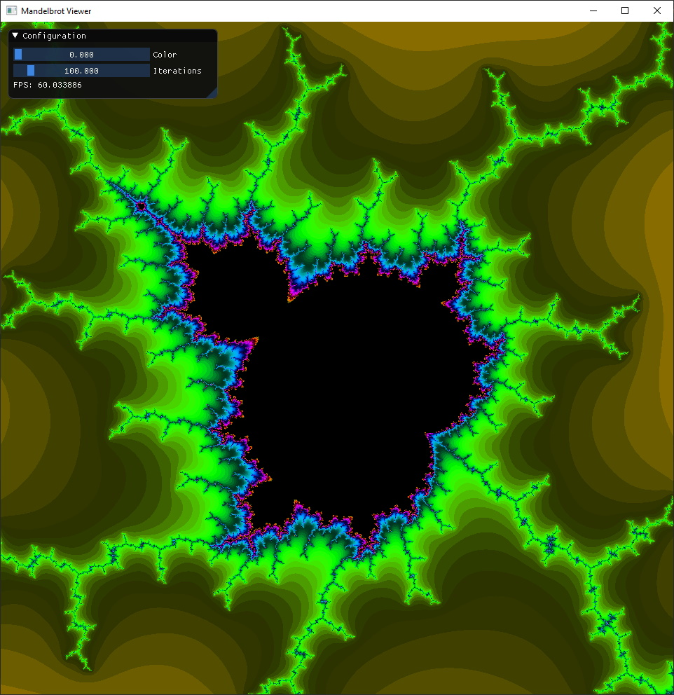

# Mandelbrot Viewer
Mandelbrot Viewer is a simple application which utilises the GPU via OpenGL to visualize the Mandelbrot Set in real time. The maximum possible zoom is 64-bit due to the limitations of OpenGL Doubles. [v1.0 C++ port of this project](https://github.com/cianjinks/MandelbrotViewerCPP)

I wrote a tutorial series on how to create this project on my blog which can be found [here](https://cianjinks.github.io/2020-05-16-opengl-tutorial-visualizing-the-mandelbrot-set-fractal-part-1-of-2/).

A YouTube video demonstrating the project can be viewed [here](https://www.youtube.com/watch?v=7fw9jsuc_1M).

## Preview

## Building

  The application can be built with [Maven](https://maven.apache.org/):
    
    mvn clean package
    
  The jar file will be available in the `./target` directory.

## Controls

  <kbd>W</kbd>, <kbd>A</kbd>, <kbd>S</kbd>, <kbd>D</kbd> for panning.
  
  <kbd>Z</kbd>, <kbd>X</kbd> or scroll wheel for zooming in and out.
  
  <kbd>K</kbd> to take a screenshot. **(Currently Disabled)**
  
## Configuration

**GUI**

    The UI allows you to configure the color and precision of the set via a pure 
    java binding of ImGUI. The variables it modifies are the uniform variables u_Color
    and u_maxIter used in the fragment shader below.

More useful configuration variables:

  **src/main/java/Application.java**
  
    PIXEL_WIDTH & PIXEL_HEIGHT:
    - The window's resolution.
    WIDTH & HEIGHT:
    - The scale of the complex axis (4 would be [-2, 2]).
    TITLE:
    - The window's title.
    BACKGROUND_COLOUR:
    - The window's background colour.
    
  **src/resources/shaders/frag.shader**
  
    This file contains the math for generating the Mandelbrot Set. 
    If you wish to change the colours of the set without the UI you should modify the 
    colorFunc function.
    It takes in the uniform u_maxIter which is the number of iterations it took before 
    the modulus of a point on the set became >= 4.
    
## Libraries

* [LWJGL 3](https://www.lwjgl.org/) (minimal OpenGL configuration)
* [JOML](https://github.com/JOML-CI/JOML) (math library)
* [Dear ImGUI](https://github.com/SpaiR/imgui-java) (pure java binding of the C++ UI library)
